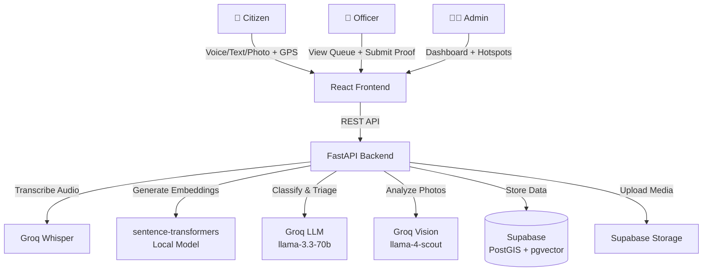

# CivicPulse — AI-Driven Municipal Civic Resolution Platform

> 🏙️ An AI-powered platform that transforms how cities handle citizen complaints — from intake to resolution, with deduplication, auto-triage, fraud detection, and infrastructure hotspot alerts.


---

## 🏗️ Architecture



---

## ⚡ Features

| Feature | Description |
|---------|-------------|
| 🎤 **Multi-Modal Intake** | Accept complaints via text, voice (Whisper STT), or photo (Vision AI) with GPS |
| 🔄 **Smart Deduplication** | PostGIS spatial proximity + semantic similarity to merge duplicate reports |
| 🤖 **AI Auto-Triage** | LLM classifies department, urgency (LOW→CRITICAL), and generates 3-step field SOPs |
| 📸 **Anti-Fraud Verification** | GPS geofencing + Vision AI before/after comparison to verify repairs |
| 🗺️ **Hotspot Detection** | DBSCAN clustering finds infrastructure root-cause patterns |
| 📱 **Realtime Updates** | Supabase Realtime subscriptions for live ticket status changes |

---

## 🚀 Quick Setup

### Prerequisites

- **Python 3.10+**
- **Node.js 18+** and npm
- **Supabase** project ([supabase.com](https://supabase.com))
- **Groq API Key** ([console.groq.com](https://console.groq.com))

### 1. Clone & Configure

```bash
cd civicpulse

# Backend env
cp backend/.env.example backend/.env
# Edit backend/.env with your API keys

# Frontend env
cp frontend/.env.example frontend/.env
# Edit frontend/.env with your Supabase URL and anon key
```

### 2. Database Setup

1. Go to your Supabase Dashboard → **SQL Editor**
2. Paste and run the contents of `backend/db/schema.sql`
3. Also run these SQL functions (needed for dedup + hotspot detection):

```sql
-- Function: Find nearby tickets (used by dedup_service.py)
CREATE OR REPLACE FUNCTION find_nearby_tickets(
    search_lat DOUBLE PRECISION,
    search_lng DOUBLE PRECISION,
    radius_m DOUBLE PRECISION DEFAULT 100
)
RETURNS TABLE (
    id UUID,
    category TEXT,
    sub_category TEXT,
    department department_type,
    urgency urgency_level,
    status ticket_status,
    lat DOUBLE PRECISION,
    lng DOUBLE PRECISION,
    upvote_count INTEGER,
    created_at TIMESTAMPTZ
) AS $$
BEGIN
    RETURN QUERY
    SELECT
        mt.id, mt.category, mt.sub_category, mt.department, mt.urgency, mt.status,
        mt.lat, mt.lng, mt.upvote_count, mt.created_at
    FROM master_tickets mt
    WHERE mt.status NOT IN ('RESOLVED', 'CLOSED')
    AND ST_DWithin(
        mt.location,
        ST_SetSRID(ST_MakePoint(search_lng, search_lat), 4326)::geography,
        radius_m
    );
END;
$$ LANGUAGE plpgsql;

-- Function: Detect hotspot clusters (used by hotspot_service.py)
CREATE OR REPLACE FUNCTION detect_hotspot_clusters(
    eps_meters DOUBLE PRECISION DEFAULT 100,
    min_pts INTEGER DEFAULT 5,
    hours_window INTEGER DEFAULT 72
)
RETURNS TABLE (
    category TEXT,
    center_lat DOUBLE PRECISION,
    center_lng DOUBLE PRECISION,
    radius_m DOUBLE PRECISION,
    ticket_count BIGINT,
    ticket_ids UUID[]
) AS $$
BEGIN
    RETURN QUERY
    WITH clustered AS (
        SELECT
            mt.id,
            mt.category,
            mt.lat,
            mt.lng,
            mt.location,
            -- Project to Web Mercator (EPSG:3857) so eps operates on meters
            ST_ClusterDBSCAN(
                ST_Transform(mt.location::geometry, 3857),
                eps := eps_meters,
                minpoints := min_pts
            ) OVER (PARTITION BY mt.category) AS cluster_id
        FROM master_tickets mt
        WHERE mt.created_at >= NOW() - (hours_window || ' hours')::INTERVAL
          AND mt.status NOT IN ('RESOLVED', 'CLOSED')
    )
    SELECT
        c.category,
        AVG(c.lat) AS center_lat,
        AVG(c.lng) AS center_lng,
        GREATEST(eps_meters, COALESCE(MAX(ST_Distance(c.location, ST_SetSRID(ST_MakePoint(AVG(c.lng), AVG(c.lat)), 4326)::geography)), eps_meters)) AS radius_m,
        COUNT(*)::BIGINT AS ticket_count,
        ARRAY_AGG(c.id) AS ticket_ids
    FROM clustered c
    WHERE c.cluster_id IS NOT NULL
    GROUP BY c.category, c.cluster_id
    HAVING COUNT(*) >= min_pts;
END;
$$ LANGUAGE plpgsql;

-- Function: Atomic upvote increment (avoids TOCTOU race conditions)
CREATE OR REPLACE FUNCTION increment_ticket_upvote(target_ticket_id UUID)
RETURNS INTEGER AS $$
DECLARE
    new_count INTEGER;
BEGIN
    UPDATE master_tickets
    SET upvote_count = COALESCE(upvote_count, 1) + 1
    WHERE id = target_ticket_id
    RETURNING upvote_count INTO new_count;
    
    RETURN new_count;
END;
$$ LANGUAGE plpgsql;

-- Function: Find nearby hotspots (dedup for hotspot alerts)
CREATE OR REPLACE FUNCTION find_nearby_hotspots(
    search_lat DOUBLE PRECISION,
    search_lng DOUBLE PRECISION,
    radius_m DOUBLE PRECISION DEFAULT 200,
    search_category TEXT DEFAULT '',
    search_sub_category TEXT DEFAULT NULL
)
RETURNS TABLE (id UUID, category TEXT, status alert_status) AS $$
BEGIN
    RETURN QUERY
    SELECT ha.id, ha.category, ha.status
    FROM hotspot_alerts ha
    WHERE ha.category = search_category
    AND ha.status != 'RESOLVED'
    AND ST_DWithin(
        ST_SetSRID(ST_MakePoint(ha.center_lng, ha.center_lat), 4326)::geography,
        ST_SetSRID(ST_MakePoint(search_lng, search_lat), 4326)::geography,
        radius_m
    );
END;
$$ LANGUAGE plpgsql;
```

4. Create a **Storage bucket** called `complaint-media` (set to **Public**):
   - Dashboard → Storage → New Bucket → Name: `complaint-media` → Public: ✅

### 3. Backend

```bash
cd backend
pip install -r requirements.txt
uvicorn main:app --reload --host 0.0.0.0 --port 8000
```

> ⚠️ First launch downloads the `all-MiniLM-L6-v2` model (~80MB). Subsequent starts are instant.

### 4. Frontend

```bash
cd frontend
npm install
npm run dev
```

Open **http://localhost:5173** in your browser.

### 5. Seed Demo Data

```bash
cd civicpulse
python seed/seed_demo_data.py
```

This creates ~34 tickets clustered around Pune, ready for the hotspot detection demo.

---

## 🌐 Environment Variables

| Variable | Required | Description |
|----------|----------|-------------|
| `GROQ_API_KEY` | ✅ | Groq API key for LLM, Vision, and Whisper |
| `SUPABASE_URL` | ✅ | Your Supabase project URL |
| `SUPABASE_ANON_KEY` | ✅ | Supabase anonymous key (frontend) |
| `SUPABASE_SERVICE_ROLE_KEY` | ✅ | Supabase service role key (backend) |
| `WHATSAPP_API_TOKEN` | ❌ | WhatsApp Business API token (mocked) |
| `DEDUP_SIMILARITY_THRESHOLD` | ❌ | Cosine similarity threshold (default: 0.80) |
| `GEOFENCE_RADIUS_METERS` | ❌ | GPS verification radius (default: 150) |
| `HOTSPOT_EPS_METERS` | ❌ | DBSCAN cluster radius (default: 100) |
| `HOTSPOT_MIN_POINTS` | ❌ | Min tickets for hotspot (default: 5) |

---

## 📁 Project Structure

```
civicpulse/
├── backend/
│   ├── main.py                     # FastAPI entrypoint
│   ├── config.py                   # Environment config
│   ├── db/schema.sql               # Database schema
│   ├── db/supabase_client.py       # Supabase client
│   ├── routers/                    # API endpoints (one per feature)
│   ├── services/                   # Business logic (one per pipeline stage)
│   ├── models/schemas.py           # Pydantic models
│   └── utils/                      # Groq client + prompt templates
├── frontend/
│   ├── src/pages/citizen/          # Citizen screens
│   ├── src/pages/officer/          # Officer screens
│   ├── src/pages/admin/            # Admin screens
│   ├── src/components/             # Reusable UI components
│   └── src/hooks/                  # Custom React hooks
├── seed/seed_demo_data.py          # Demo data seeder (Pune)
└── README.md
```

---

## 🎮 Demo Walkthrough

1. **Citizen → Report Issue**: Open `/report`, describe a pothole with text/voice, take a photo, submit
2. **System → Auto-triage**: AI classifies as `Roads & Infrastructure / HIGH` and generates 3-step SOP
3. **Officer → Queue**: Open `/officer`, see prioritized list, click a ticket
4. **Officer → Fix & Prove**: Follow SOP checklist, take before/after GPS-verified photos
5. **System → Verify**: AI compares photos, checks geofence, marks as resolved
6. **Citizen → Confirm**: Citizen verifies the fix or reopens the ticket
7. **Admin → Dashboard**: View metrics, run hotspot detection, see Pune cluster map

---

## 📝 Editing Guide

| "I need to change..." | Edit this file |
|-----------------------|----------------|
| How urgency is scored | `backend/services/triage_service.py` |
| LLM prompt wording | `backend/utils/prompts.py` |
| Dedup similarity threshold | `backend/.env` → `DEDUP_SIMILARITY_THRESHOLD` |
| Officer's camera UI | `frontend/src/components/PhotoCapture.jsx` |
| Priority queue formula | `backend/services/geo_service.py` |
| Map styling/behavior | `frontend/src/components/MapView.jsx` |
| Admin dashboard layout | `frontend/src/pages/admin/AdminDashboardPage.jsx` |

---

Built with ❤️ for smarter cities.
