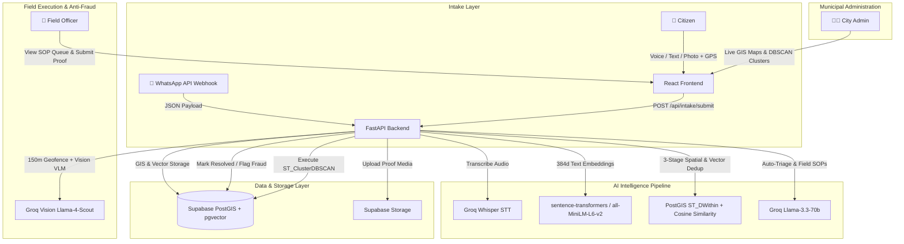

# 🏙️ JanSahayAI — AI-Driven Municipal Civic Resolution Platform

> An end-to-end AI-powered municipal civic resolution and intelligence platform designed to eliminate municipal complaint backlogs, ticket spam, and resolution fraud through Multi-Modal Intake, Spatial Vector Deduplication, Automated AI Triage, Anti-Fraud Vision Verification, and Infrastructure Hotspot Detection.


---

## 📌 Problem Statement vs. Our Solution

| Traditional Municipal Portals | 🚀 JanSahayAI Platform |
| :--- | :--- |
| **High Friction:** Text-heavy complex forms exclude illiterate or non-technical citizens. | 🎙️ **Multi-Modal Intake:** Audio voice notes (Groq Whisper STT), photos, text, or WhatsApp with auto-GPS locking. |
| **Ticket Flooding:** 100 reports for 1 pothole create 100 separate tickets clogging the database. | 🔄 **Smart 3-Stage Deduplication:** PostGIS 100m spatial search + `all-MiniLM-L6-v2` vector similarity (>0.80) auto-merges duplicates into upvotes. |
| **Vague Context:** Officers receive notes like *"water leak near market"* without actionable steps. | 🤖 **AI Auto-Triage & SOPs:** Groq LLM (`llama-3.3-70b`) auto-classifies department, urgency (LOW→CRITICAL), and generates 3-step field SOPs. |
| **Resolution Fraud:** Officers mark tickets resolved without visiting the site or uploading fake photos. | 🛡️ **Anti-Fraud Dual Lock:** 150m GPS Geofence + Groq Vision (`llama-4-scout`) before/after structural photo comparison. |
| **Reactive Fixing:** Departments fix isolated symptoms while underlying root-cause failures go unnoticed. | 🗺️ **Spatial Hotspot Intelligence:** PostGIS + scikit-learn DBSCAN clustering detects systemic infrastructure failures in real-time. |

---

## 🏗️ System Architecture



---

## ⚡ Key Breakthrough Features

### 🎙️ 1. Inclusive Multi-Modal Intake & WhatsApp Integration
* **Voice-to-Text Transcription:** Citizens record audio voice notes in local languages, transcribed instantly into structured text using Groq Whisper.
* **Photo Vision Triage:** Uploading a photo allows Vision AI to automatically extract defect descriptions and category context.
* **WhatsApp Webhook Integration:** Submit complaints directly over WhatsApp without downloading an application.
* **Automatic Geolocation:** Browser/device GPS locks latitude and longitude automatically.

### 🔄 2. Smart 3-Stage Spatial & Semantic Deduplication
When a new report arrives, the backend runs a 3-stage pipeline:
1. **Stage 1 (Spatial Filter):** PostGIS `ST_DWithin` queries active tickets within a **100m radius**.
2. **Stage 2 (Hard Category Filter):** Enforces strict department and defect sub-category matching (e.g., pothole reports will never merge with a nearby water leak).
3. **Stage 3 (Semantic Vector Similarity):** Generates 384-dimensional dense text embeddings via `sentence-transformers/all-MiniLM-L6-v2` and evaluates cosine similarity against all candidate reports (Threshold $\ge 0.80$).
* **Auto-Upvote Conversion:** Matching tickets are converted into an **Upvote** on the existing Master Ticket, increasing its priority score while instantly notifying the reporter.

### 🤖 3. AI Auto-Triage & Field SOP Generation
* **Department Classification:** Automatically assigns tickets to 1 of 5 municipal departments: *Water Supply & Sewerage, Roads & Infrastructure, Solid Waste Management, Electrical & Streetlighting, Health & Sanitation*.
* **Urgency Scoring:** Assigns severity levels: `LOW`, `MEDIUM`, `HIGH`, or `CRITICAL`.
* **Actionable Field SOPs:** LLM generates 3 sequential Standard Operating Procedure (SOP) steps for field technicians along with required equipment lists.
* **Citizen SMS Notifications:** Auto-drafts localized status SMS notifications.

### 📈 4. Sybil-Resistant Dynamic Priority Scoring Engine
Calculates master ticket priority ordering dynamically:
$$\text{Priority Score} = (\text{SLA Elapsed Hours} \times 0.4) + (\text{Urgency Weight} \times 0.4) + \text{Duplicate Score Component}$$
* **Urgency Weights:** `LOW` = 1.0, `MEDIUM` = 3.0, `HIGH` = 7.0, `CRITICAL` = 10.0.
* **Sybil-Resistant Scaling:** Linear scaling ($0.2 \times N$) for upvotes 1–5, transitioning into logarithmic scaling $\min(5.0, 1.0 + \log_2(N - 3) \times 0.8)$ to prevent spam manipulation while rewarding genuine public priority.

### 🛡️ 5. Anti-Fraud Dual Verification System
Locks resolution sign-offs behind 2 automated validation layers:
1. **Geofencing Check:** Verifies field officer is within **150 meters** of the ticket location during proof submission.
2. **Vision VLM Comparison:** Groq Vision (`llama-4-scout`) compares original citizen complaint photo against officer's repair photo to visually confirm defect resolution and site location match before marking ticket as `RESOLVED`.

### 🗺️ 6. Spatial DBSCAN Infrastructure Hotspot Detection
* **Clustering Algorithm:** Runs `ST_ClusterDBSCAN` over PostGIS spatial geometry ($Epsilon = 100\text{m}$, $MinPoints = 5$, $TimeWindow = 72\text{h}$).
* **Root-Cause Alerts:** Identifies repeated incidents (e.g., 6 pipe leakages in 50m) and groups them into an **Infrastructure Hotspot Alert** for city administrators to fix root structural failures.

---

## 🛠️ Complete Technology Stack

| Layer | Technologies & Libraries | Key Responsibilities |
| :--- | :--- | :--- |
| **Frontend** | React 18, Vite, TailwindCSS, React-Leaflet, Leaflet Heatmap (`leaflet.heat`), Lucide Icons | Responsive multi-role portals (Citizen, Officer, Admin), interactive GIS maps |
| **Backend** | Python 3.10+, FastAPI v0.115, Uvicorn, Pydantic v2 | High-performance asynchronous REST API microservices |
| **AI / ML Models** | Groq API (`llama-3.3-70b-versatile`, `llama-4-scout`), Groq Whisper (`whisper-large-v3`), HuggingFace `sentence-transformers` (`all-MiniLM-L6-v2`), PyTorch, scikit-learn (DBSCAN) | Multi-modal speech transcription, 384d vector embeddings, auto-triage, vision proof verification, spatial clustering |
| **Database & GIS** | Supabase PostgreSQL, PostGIS spatial extension, `pgvector` | Spatial queries (`ST_DWithin`, `ST_ClusterDBSCAN`), vector embeddings storage |
| **Storage & Realtime** | Supabase Storage (`complaint-media`), Supabase Realtime (WebSockets) | Public media asset buckets, live ticket status streaming |

---

## 📁 Project Structure

```
civicpulse/
├── backend/
│   ├── main.py                     # FastAPI server entrypoint
│   ├── config.py                   # Environment settings & Pydantic config
│   ├── db/
│   │   ├── schema.sql              # Database schema & PostGIS triggers
│   │   └── supabase_client.py      # Async Supabase connection client
│   ├── routers/                    # REST API endpoints
│   │   ├── intake_router.py        # Voice, photo, text complaint submission
│   │   ├── ticket_router.py        # Ticket lookup, upvoting, status tracking
│   │   ├── officer_router.py       # Officer queue & SOP execution
│   │   ├── verification_router.py  # Anti-fraud Geofence + Vision verification
│   │   ├── admin_router.py         # Hotspots, cluster overrides & analytics
│   │   └── whatsapp_webhook.py     # WhatsApp Business API integration
│   ├── services/                   # Business logic pipelines
│   │   ├── dedup_service.py        # 3-Stage spatial + vector deduplication
│   │   ├── triage_service.py       # Groq LLM auto-triage & SOP generator
│   │   ├── embedding_service.py    # Local sentence-transformers embeddings
│   │   ├── priority_service.py     # Sybil-resistant priority scoring engine
│   │   ├── vision_service.py       # Groq Vision before/after photo verifier
│   │   ├── hotspot_service.py      # PostGIS DBSCAN spatial clustering
│   │   ├── geo_service.py          # Geofencing calculation utilities
│   │   └── transcription_service.py# Groq Whisper speech-to-text wrapper
│   ├── models/schemas.py           # Pydantic request/response schemas
│   └── utils/                      # Groq client setup & prompt templates
├── frontend/
│   ├── src/
│   │   ├── pages/
│   │   │   ├── citizen/            # Report, Track, and Upvote pages
│   │   │   ├── officer/            # Task Queue & SOP execution pages
│   │   │   └── admin/              # Executive Dashboard & Hotspot maps
│   │   ├── components/             # Reusable UI & Map components
│   │   ├── hooks/                  # React custom hooks (Realtime subscriptions)
│   │   └── supabaseClient.js       # Supabase frontend JS client
│   └── package.json
├── seed/seed_demo_data.py          # Seeder script for demo ticket clusters
└── README.md
```

---

## ⚡ Quick Setup Guide

### Prerequisites
* **Python 3.10+**
* **Node.js 18+** and npm
* **Supabase Account** ([supabase.com](https://supabase.com))
* **Groq API Key** ([console.groq.com](https://console.groq.com))

---

### 1. Database Setup (Supabase)

1. Open your Supabase Dashboard $\rightarrow$ **SQL Editor**.
2. Run the SQL schema script in [`backend/db/schema.sql`](file:///c:/hack1/civicpulse/backend/db/schema.sql).
3. Execute the custom SQL functions below:

```sql
-- Spatial Search Function for Deduplication
CREATE OR REPLACE FUNCTION find_nearby_tickets(
    search_lat DOUBLE PRECISION,
    search_lng DOUBLE PRECISION,
    radius_m DOUBLE PRECISION DEFAULT 100,
    search_department TEXT DEFAULT NULL,
    search_sub_category TEXT DEFAULT NULL
)
RETURNS TABLE (
    id UUID,
    category TEXT,
    sub_category TEXT,
    department department_type,
    urgency urgency_level,
    status ticket_status,
    lat DOUBLE PRECISION,
    lng DOUBLE PRECISION,
    upvote_count INTEGER,
    created_at TIMESTAMPTZ
) AS $$
BEGIN
    RETURN QUERY
    SELECT
        mt.id, mt.category, mt.sub_category, mt.department, mt.urgency, mt.status,
        mt.lat, mt.lng, mt.upvote_count, mt.created_at
    FROM master_tickets mt
    WHERE mt.status NOT IN ('RESOLVED', 'CLOSED')
    AND ST_DWithin(
        mt.location,
        ST_SetSRID(ST_MakePoint(search_lng, search_lat), 4326)::geography,
        radius_m
    );
END;
$$ LANGUAGE plpgsql;

-- DBSCAN Hotspot Cluster Detection Function
CREATE OR REPLACE FUNCTION detect_hotspot_clusters(
    eps_meters DOUBLE PRECISION DEFAULT 100,
    min_pts INTEGER DEFAULT 5,
    hours_window INTEGER DEFAULT 72
)
RETURNS TABLE (
    category TEXT,
    center_lat DOUBLE PRECISION,
    center_lng DOUBLE PRECISION,
    radius_m DOUBLE PRECISION,
    ticket_count BIGINT,
    ticket_ids UUID[]
) AS $$
BEGIN
    RETURN QUERY
    WITH clustered AS (
        SELECT
            mt.id,
            mt.category,
            mt.lat,
            mt.lng,
            mt.location,
            ST_ClusterDBSCAN(
                ST_Transform(mt.location::geometry, 3857),
                eps := eps_meters,
                minpoints := min_pts
            ) OVER (PARTITION BY mt.category) AS cluster_id
        FROM master_tickets mt
        WHERE mt.created_at >= NOW() - (hours_window || ' hours')::INTERVAL
          AND mt.status NOT IN ('RESOLVED', 'CLOSED')
    )
    SELECT
        c.category,
        AVG(c.lat) AS center_lat,
        AVG(c.lng) AS center_lng,
        GREATEST(eps_meters, COALESCE(MAX(ST_Distance(c.location, ST_SetSRID(ST_MakePoint(AVG(c.lng), AVG(c.lat)), 4326)::geography)), eps_meters)) AS radius_m,
        COUNT(*)::BIGINT AS ticket_count,
        ARRAY_AGG(c.id) AS ticket_ids
    FROM clustered c
    WHERE c.cluster_id IS NOT NULL
    GROUP BY c.category, c.cluster_id
    HAVING COUNT(*) >= min_pts;
END;
$$ LANGUAGE plpgsql;
```

4. Create a public storage bucket named **`complaint-media`**:
   * Dashboard $\rightarrow$ **Storage** $\rightarrow$ **New Bucket** $\rightarrow$ Name: `complaint-media` $\rightarrow$ Public: ✅

---

### 2. Backend Setup

```bash
cd backend

# Install dependencies
pip install -r requirements.txt

# Create .env configuration
cp .env.example .env
# Fill in GROQ_API_KEY, SUPABASE_URL, and SUPABASE_SERVICE_ROLE_KEY in .env

# Run FastAPI dev server
uvicorn main:app --reload --host 0.0.0.0 --port 8000
```
> *Note: On first startup, the local `sentence-transformers/all-MiniLM-L6-v2` model (~80MB) downloads automatically.*

---

### 3. Frontend Setup

```bash
cd frontend

# Install dependencies
npm install

# Create .env configuration
cp .env.example .env
# Fill in VITE_SUPABASE_URL and VITE_SUPABASE_ANON_KEY in .env

# Start Vite dev server
npm run dev
```

Open **`http://localhost:5173`** in your browser.

---

### 4. Seed Demo Data

```bash
# From project root directory
python seed/seed_demo_data.py
```
This populates ~34 synthetic civic tickets around Pune to demonstrate instant DBSCAN hotspot clustering.

---

## 🌐 Environment Variables Reference

| Variable Name | Required | Description |
| :--- | :--- | :--- |
| `GROQ_API_KEY` | ✅ | Groq API key for LLM (`llama-3.3-70b`), Vision, and Whisper models |
| `SUPABASE_URL` | ✅ | Supabase project URL |
| `SUPABASE_SERVICE_ROLE_KEY` | ✅ | Supabase service role key (backend data management) |
| `SUPABASE_ANON_KEY` | ✅ | Supabase public anonymous key (frontend client) |
| `DEDUP_SIMILARITY_THRESHOLD` | ❌ | Cosine similarity threshold for vector deduplication (Default: `0.80`) |
| `GEOFENCE_RADIUS_METERS` | ❌ | Maximum allowed radius for officer GPS verification (Default: `150`) |
| `HOTSPOT_EPS_METERS` | ❌ | DBSCAN cluster radius parameter (Default: `100`) |
| `HOTSPOT_MIN_POINTS` | ❌ | Minimum tickets required to trigger a hotspot alert (Default: `5`) |

---

## 🎮 Hackathon Demo Walkthrough Guide

1. **Submit Issue (`/report`):** Open Citizen Portal, record an audio voice complaint or upload a photo of a pothole, and submit.
2. **Test Deduplication:** Submit a second report at the exact same location. The system detects spatial & semantic similarity and **converts it into an Upvote** on the original Master Ticket.
3. **Field Officer Task Queue (`/officer`):** Log into Officer Portal. View the high-priority task, complete with **Urgency: HIGH** and the **AI-generated 3-Step Field SOP checklist**.
4. **Anti-Fraud Proof Upload:** Click **Complete Task**, upload a post-repair photo. The system runs **150m Geofencing check + Vision AI comparison** before resolving the ticket.
5. **Admin Hotspot Management (`/admin`):** Open Admin Dashboard. Click **Detect Hotspots** to view the live PostGIS DBSCAN cluster map combining nearby complaints into an infrastructure alert.

---

## 📄 License & Acknowledgments

Built with ❤️ for smarter, cleaner, and transparent cities.
