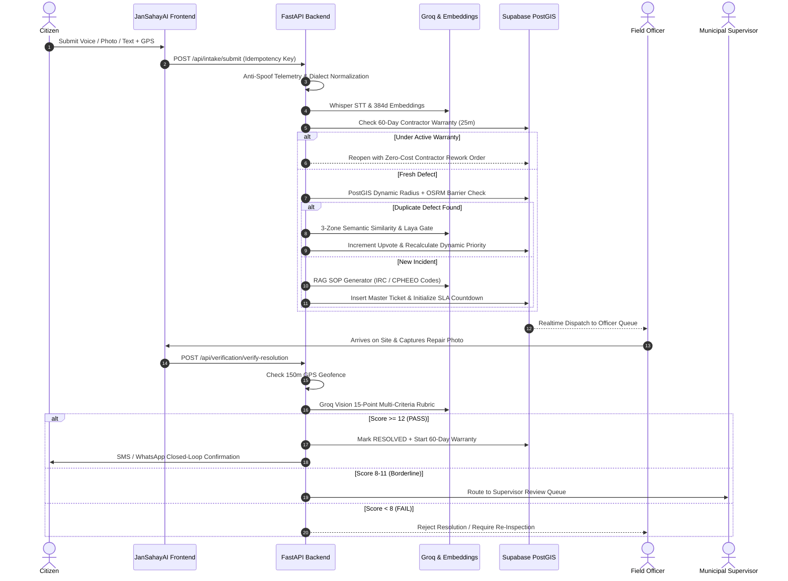

# 🏙️ JanSahayAI (जनसहाय AI) — AI-Driven Municipal Civic Resolution Platform

> An enterprise-grade, pilot-ready civic governance operating system engineered to eliminate municipal complaint backlogs, duplicate ticket spam, and resolution fraud through **Multi-Modal Intake**, **Topological Road-Aware Deduplication**, **RAG-Grounded Field SOPs**, **15-Point Multi-Criteria Vision Anti-Fraud**, **60-Day Contractor Defect Liability Tracking**, and **DBSCAN + Poisson Statistical Hotspot Intelligence**.

---

<div align="center">


</div>

---

## 📌 Problem Statement vs. JanSahayAI Breakthrough

| Traditional Municipal Grievance Portals | 🚀 JanSahayAI Municipal OS |
| :--- | :--- |
| **High Digital Literacy Barrier:** Complex multi-page English forms exclude non-technical, rural, or illiterate citizens. | 🎙️ **Multi-Modal Vernacular Intake:** Voice notes in Hindi/Marathi via Groq Whisper STT + phonetic landmark gazetteer + WhatsApp Bot integration. |
| **Grievance Spam & Duplication:** 100 residents reporting the same broken main create 100 disjointed tickets, choking databases. | 🔄 **Topological 3-Stage Deduplication:** PostGIS dynamic GPS radius + OSRM road network barrier detection + `all-MiniLM-L6-v2` 384d semantic similarity + Laya typed decision confirmation. |
| **Vague, Unactionable Dispatch:** Tickets say *"water leaking near bazaar"* with no engineering guidance or safety protocols. | 🤖 **RAG-Grounded Municipal SOPs:** Ingests official Indian engineering standards (IRC:SP:16, CPHEEO, SWM Rules 2016, CEA Safety Regulations 2010) to generate cited 3-step field protocols and equipment checklists. |
| **Resolution Fraud & Fake Closures:** Field crews mark issues "resolved" from home or upload unverified pictures. | 🛡️ **Anti-Fraud Dual Lock:** 150m device GPS Geofence + Groq Vision (`qwen/qwen3.8-27b`) 15-point multi-criteria rubric scoring Site Match, Defect Resolution, and Repair Quality. |
| **Contractor Blame-Shifting:** Repaired potholes wash away in weeks while contractors get paid repeatedly with zero warranty tracking. | 👷 **60-Day Contractor Defect Liability Engine:** Auto-tracks defect warranties; recurring failures within 60 days force zero-cost rework assignments and deduct contractor performance scores. |
| **Blind Spots & Reactive Fixes:** Departments fix isolated symptoms repeatedly while underlying structural failures remain invisible. | 🗺️ **Spatial DBSCAN + Poisson Hotspot Intelligence:** PostGIS metric projections (UTM 43N) combined with Poisson anomaly z-scores ($Z \ge 2.0$) and Open-Meteo weather radar to predict systemic failures. |

---

## 🏗️ System Architecture

```mermaid
graph TB
    subgraph Multi-Modal Intake & Edge Layer
        C[👤 Citizen] -->|Voice Note / Photo / Text| PWA[React 18 PWA]
        WA[📱 WhatsApp API Webhook] -->|HMAC-SHA256 Payload| BE[FastAPI Backend]
        PWA -->|Offline IndexedDB + Web Crypto SHA-256| PWA
        PWA -->|POST /api/intake/submit + Idempotency Key| BE
        BE -->|Telemetry Check: Mock GPS / Speed / Altitude| SEC[Anti-Spoof Gate]
    end

    subgraph AI Intelligence & Triage Pipeline
        BE -->|Phonetic Normalization| GAZ[Indic Vernacular Gazetteer]
        BE -->|Audio STT| STT[Groq Whisper large-v3-turbo]
        BE -->|384d Embeddings| EMB[sentence-transformers all-MiniLM-L6-v2]
        BE -->|OSRM Road Network Snapping| ROAD[OSRM Topological Distance]
        BE -->|Dynamic GPS Radius ST_DWithin| POSTGIS[(PostGIS Spatial Filter)]
        BE -->|3-Zone Semantic Decision Gate| LAYA[Laya Decision Classifier]
        BE -->|RAG Regulatory Knowledge Base| RAG[(IRC:SP:16 / CPHEEO / SWM 2016)]
        BE -->|Field Protocol Generation| LLM[Groq Llama-3.3-70b]
    end

    subgraph Data, Security & Event Ledger
        BE -->|Tenant-Isolated RLS Queries| DB[(Supabase PostgreSQL + pgvector)]
        BE -->|Append-Only Lifecycle Events| AUDIT[ticket_events Immutable Ledger]
        BE -->|15-Minute Signed URL Media Storage| S3[Supabase Storage Bucket]
    end

    subgraph Field Execution & Anti-Fraud Dual-Lock
        O[👷 Field Officer] -->|View SOP Queue & Upload Proof| PWA
        BE -->|150m Haversine Check| GEO[GPS Geofence Validator]
        BE -->|15-Point Multi-Criteria Rubric| VLM[Groq Vision Qwen-3.8-27B]
        BE -->|Recurring Failure Check < 60 Days| WAR[Contractor Defect Liability Engine]
    end

    subgraph Municipal Intelligence & Transparency
        A[🏛️ Municipal Admin] -->|Live Deck.gl Hotspots & Poisson Z-Scores| PWA
        PUB[👥 Public / Press] -->|Live Department Workload & SLA Board| PWA
        BE -->|Open-Meteo Rain Radar + Pipe Degradation| RISK[Asset Risk Radar]
    end
```

---

## ⚡ Key Breakthrough Features

### 🎙️ 1. Inclusive Vernacular Intake & Hardened WhatsApp Integration
* **Vernacular Voice-to-Text Transcription:** Citizens record audio voice notes in Marathi, Hindi, or English. Transcribed at sub-second latency using Groq Whisper (`whisper-large-v3-turbo`).
* **Indic Phonetic Gazetteer (`backend/services/dialect_service.py`):** Pre-embedding normalization maps vernacular colloquialisms to standard municipal entities (e.g., *"ganpati mandir chowk"* $\to$ *"Ganesh Temple Intersection"*, *"gali 4"*, *"metro pillar 142"*). Runs in $< 1\text{ms}$ with zero API cost.
* **Anti-Spoof Telemetry Gate:** Validates horizontal accuracy, flags mock location providers (`is_mock_location`), and rejects impossible speeds ($> 120\text{ km/h}$) or altitude anomalies before tickets are accepted.
* **Production WhatsApp Business Webhook:** Includes HMAC-SHA256 signature verification, media download retries with exponential backoff, and conversational state tracking.
* **API Idempotency Protection:** Enforces SHA-256 request fingerprinting to prevent accidental double-reporting during network retries.

---

### 🔄 2. Topological Road-Network Deduplication Engine
Traditional systems use naive radius checks that merge complaints on opposite sides of rivers, railway tracks, or highway barriers. JanSahayAI enforces a 3-stage topological pipeline:
1. **Dynamic GPS Radius Filter:** Rather than a static circle, the radius dynamically adjusts to device GPS accuracy:
   $$\text{Radius} = \max(30\text{m}, \min(120\text{m}, \text{GPS Accuracy} \times 1.5))$$
   Linear defects (water mains, street power cables) automatically scale to a $200\text{m}$ corridor.
2. **Topological Road-Network Verification (`backend/services/road_network_service.py`):** Snaps coordinates to OpenStreetMap centerlines via OSRM. If:
   $$\frac{\text{Road Routing Distance}}{\text{Straight-Line Distance}} > 1.8$$
   the algorithm recognizes a physical barrier (e.g., railway line, highway divider) and **aborts** false merging.
3. **Three-Zone Semantic Gate with Laya Confirmation:**
   * **High Confidence ($\ge 0.90$):** Instantly merged as an upvote.
   * **Low Confidence ($< 0.60$):** Classified as an independent defect.
   * **Ambiguous Zone ($0.60 \le \text{Similarity} < 0.90$):** Evaluated by **Laya** (`convaiinnovations/laya` `noul` decision model) to confirm physical identity.
* **Sybil-Resistant Auto-Upvoting:** Confirmed duplicate complaints merge into the existing Master Ticket, increasing public weight without cluttering the dispatch queue.

---

### 🤖 3. RAG-Grounded Municipal SOP Generation
Field officers receive actionable, safety-first protocols grounded in authoritative Indian municipal engineering standards rather than generic AI advice:
* **Built-in Regulatory Vector Store (`backend/services/rag_sop_service.py`):**
  * **IRC:SP:16 & IRC:SP:55:** Bituminous road repair, edge cutting, tack coating, and compaction depth.
  * **CPHEEO Chapters 7 & 9:** Water distribution leak repairs, isolation valve protocol, and sewage safety.
  * **Solid Waste Management (SWM) Rules 2016:** Segregation protocols and hazardous municipal waste handling.
  * **Central Electricity Authority (CEA) Regulations 2010:** High-voltage clearance and grounding safety.
* **Citations & Checklists:** Each ticket output contains a mandatory 3-step action procedure, required specialized equipment (e.g., *Cold mix asphalt, vibratory tamper, PPE*), and the exact engineering clause citation.

---

### 🛡️ 4. Anti-Fraud Dual-Lock & 15-Point Vision Rubric
To prevent ghost closures, resolution requires a dual-stage cryptographic and visual gate:
1. **150m Haversine Geofence:** The officer's mobile device must be within $150\text{m}$ of the defect's verified GPS coordinate during photo upload.
2. **15-Point Multi-Criteria Vision Rubric (`backend/services/vision_service.py`):** Groq Vision (`qwen/qwen3.8-27b`) evaluates pre-repair and post-repair photos across three orthogonal axes (0–5 points each):
   * **Site Match (0–5):** Background landmarks, curbing, tree patterns, building facades.
   * **Defect Resolution (0–5):** Verifies the specific reported pothole, leak, or garbage mound is gone.
   * **Repair Quality (0–5):** Surface grade alignment, clean edge finishing, absence of leftover debris.
3. **Automated Triage Verdicts:**
   * **Score 12–15:** Auto-approved as `RESOLVED`.
   * **Score 8–11 (Borderline):** Routed to **Supervisor Review Queue** (`/admin/review`).
   * **Score 0–7:** Rejected immediately; ticket reopened for re-inspection.
   * *High-stakes CRITICAL tickets always require mandatory supervisor confirmation.*

---

### 👷 5. 60-Day Contractor Defect Liability Warranty Engine
* **Automatic Defect Liability Period (`backend/services/warranty_service.py`):** Resolving a contractor-assigned ticket automatically locks a 60-day warranty window (`warranty_until = resolved_at + 60 days`).
* **Warranty Breach Trigger:** If a new complaint is filed within a $25\text{m}$ radius of a resolved defect within 60 days:
  * The ticket is flagged with `WARRANTY_BREACH`.
  * The work order is automatically re-assigned to the original contractor at **₹0 municipal cost**.
  * Deduces **5 penalty points** from the contractor's public reliability scorecard (`backend/services/warranty_service.py`).
  * Emits an immutable audit event for civic oversight.

---

### 🗺️ 6. Spatial DBSCAN & Poisson Statistical Hotspot Detection
* **Metric Coordinate Projection:** Uses UTM Zone 43N metric projection for high-accuracy spatial calculations in meters.
* **Poisson Anomaly Testing (`backend/services/poisson_service.py`):**
  * Routine high-density areas naturally report more issues. JanSahayAI calculates Poisson anomaly z-scores against a 30-day baseline for each 500m ward cell:
    $$Z = \frac{N - \mu}{\sqrt{\mu}}$$
  * Suppresses routine traffic noise; only spatial clusters with $Z \ge 2.0$ trigger critical municipal emergency alerts.
* **Open-Meteo Weather Radar Fusion (`backend/services/weather_service.py`):**
  * Cross-references live Open-Meteo precipitation forecasts against pipe material age and road wear index:
    $$\text{Asset Risk} = 0.6 \times \text{DegradationRisk} + 0.4 \times \text{RainfallRisk}$$
  * Generates proactive preventive replacement work orders before seasonal flooding breaks water lines.

---

### 📱 7. Offline-First PWA with Web Crypto Signatures
* **Offline Field Operations:** Field crews operating in subterranean tunnels, basements, or drainage culverts can view tickets and queue resolution proofs without network connectivity.
* **IndexedDB Background Sync:** Automatically uploads offline actions when connectivity resumes.
* **Web Crypto SHA-256 Signatures:** Captures cryptographic SHA-256 timestamps and tamper-proof telemetry at the moment of photo capture, preventing timestamp falsification.

---

### 👥 8. Transparent Public Accountability Board
* **Public Dashboard (`/transparency`):** Real-time civic visibility without login barriers.
* **Metrics Tracked:** Real-time departmental SLA compliance rates, average resolution turnaround times (hours), active officer queue load distributions, and recurring contractor failure rates.
* **Citizen Closed-Loop & Civic Karma:** Citizens receive an SMS/WhatsApp verification prompt to confirm repair quality, earning Civic Karma points for validated reports.

---

## 🔄 End-to-End Resolution Lifecycle


```mermaid
sequenceDiagram
    autonumber
    actor Citizen
    participant WebApp as JanSahayAI Frontend
    participant API as FastAPI Backend
    participant AI as Groq & Embeddings
    participant DB as Supabase PostGIS
    actor Officer as Field Officer
    actor Admin as Municipal Supervisor

    Citizen->>WebApp: Submit Voice / Photo / Text + GPS
    WebApp->>API: POST /api/intake/submit (Idempotency Key)
    API->>API: Anti-Spoof Telemetry & Dialect Normalization
    API->>AI: Whisper STT & 384d Embeddings
    API->>DB: Check 60-Day Contractor Warranty (25m)
    alt Under Active Warranty
        API-->>DB: Reopen with Zero-Cost Contractor Rework Order
    else Fresh Defect
        API->>DB: PostGIS Dynamic Radius + OSRM Barrier Check
        alt Duplicate Defect Found
            API->>AI: 3-Zone Semantic Similarity & Laya Gate
            API->>DB: Increment Upvote & Recalculate Dynamic Priority
        else New Incident
            API->>AI: RAG SOP Generator (IRC / CPHEEO Codes)
            API->>DB: Insert Master Ticket & Initialize SLA Countdown
        end
    end
    DB-->>Officer: Realtime Dispatch to Officer Queue
    Officer->>WebApp: Arrives on Site & Captures Repair Photo
    WebApp->>API: POST /api/verification/verify-resolution
    API->>API: Check 150m GPS Geofence
    API->>AI: Groq Vision 15-Point Multi-Criteria Rubric
    alt Score >= 12 (PASS)
        API->>DB: Mark RESOLVED + Start 60-Day Warranty
        API->>Citizen: SMS / WhatsApp Closed-Loop Confirmation
    else Score 8-11 (Borderline)
        API->>Admin: Route to Supervisor Review Queue
    else Score < 8 (FAIL)
        API-->>Officer: Reject Resolution / Require Re-Inspection
    end
```

---

## 🛠️ Complete Technology Stack

| Layer | Technologies & Libraries | Key Responsibilities |
| :--- | :--- | :--- |
| **Frontend Framework** | React 18.3, Vite 5.4, React Router v6 | High-performance SPA with client-side routing and instant hot reload |
| **Styling & UI Components** | TailwindCSS 3.4, Lucide React, PostCSS | Responsive design system tailored for Citizen, Officer, and Admin roles |
| **Geospatial & Visualization** | Deck.gl 9.4, MapLibre GL 6.11, React-Leaflet 4.2, `leaflet.heat` | WebGL-accelerated 3D hexbin clustering, density heatmaps, and vector tiles |
| **PWA & Offline Architecture** | Service Workers, IndexedDB, Web Crypto API | Offline task queueing, cryptographic photo tamper-proofing |
| **Backend Framework** | Python 3.10+, FastAPI 0.115, Uvicorn, Pydantic v2 | High-concurrency async REST API microservices with typed validation |
| **AI / Machine Learning** | Groq API (`whisper-large-v3-turbo`, `llama-3.3-70b`, `qwen/qwen3.8-27b`), HuggingFace `sentence-transformers` (`all-MiniLM-L6-v2`), PyTorch 2.4, scikit-learn | Speech-to-text, 384d embeddings, RAG SOP citations, 15-point vision rubric |
| **Spatial Database & Vector Store** | Supabase PostgreSQL 15, PostGIS extension, `pgvector` | Dynamic radius spatial queries (`ST_DWithin`), cosine vector similarity search |
| **Security & Data Isolation** | Row Level Security (RLS), Signed URLs (15-min TTL), HMAC-SHA256 | Strict multi-tenant isolation (Citizen, Officer, Admin), webhook verification |
| **External APIs** | Open-Meteo Weather API, OpenStreetMap OSRM Routing Engine | Real-time rainfall radar and topological road routing calculations |

---

## 📁 Repository Structure

```
JanSahayAI/
├── backend/
│   ├── main.py                             # FastAPI application entrypoint & middleware
│   ├── config.py                           # Pydantic BaseSettings & environment validation
│   ├── requirements.txt                    # Python dependencies
│   ├── db/
│   │   ├── schema.sql                      # Base relational tables, enums & triggers
│   │   ├── supabase_client.py              # Supabase async client with retry logic
│   │   └── migrations/
│   │       ├── 010_master_architecture_improvements.sql  # Audit logs & telemetry tables
│   │       ├── 011_p1_p2_feature_completeness.sql        # RLS policies & warranty columns
│   │       └── 012_fix_rls_recursion.sql                 # Hardened RLS policy rules
│   ├── models/
│   │   └── schemas.py                      # Request/response Pydantic models
│   ├── routers/
│   │   ├── intake_router.py                # Complaint submission & anti-spoof checks
│   │   ├── ticket_router.py                # Ticket lookup, tracking & citizen upvoting
│   │   ├── officer_router.py               # Officer queue, SOP fetch & status updates
│   │   ├── verification_router.py          # 150m geofence & Groq Vision 15-pt rubric
│   │   ├── admin_router.py                 # Analytics, hotspots, Poisson stats & contractors
│   │   └── whatsapp_webhook.py             # WhatsApp Business API webhook & bot
│   ├── services/
│   │   ├── dedup_service.py                # 3-Stage spatial + vector deduplication
│   │   ├── dialect_service.py              # Indic phonetic gazetteer for landmarks
│   │   ├── road_network_service.py         # OSRM topological road network barrier checks
│   │   ├── rag_sop_service.py              # Regulatory vector store (IRC / CPHEEO / SWM)
│   │   ├── triage_service.py               # Groq LLM auto-triage & field SOP generation
│   │   ├── embedding_service.py            # Local all-MiniLM-L6-v2 sentence embeddings
│   │   ├── priority_service.py             # Sybil-resistant dynamic priority engine
│   │   ├── vision_service.py               # 15-point multi-criteria vision evaluation
│   │   ├── warranty_service.py             # 60-day contractor defect liability tracking
│   │   ├── poisson_service.py              # Poisson anomaly z-score hotspot filtering
│   │   ├── weather_service.py              # Open-Meteo rainfall radar & asset risk fusion
│   │   ├── event_service.py                # Immutable append-only audit event logger
│   │   ├── job_queue.py                    # Async background task worker
│   │   └── transcription_service.py        # Groq Whisper speech-to-text wrapper
│   └── utils/
│       └── prompts.py                      # System prompts for triage, SOPs & vision
├── frontend/
│   ├── public/
│   │   ├── sw.js                           # PWA service worker with offline caching
│   │   └── manifest.json                   # Web app manifest
│   ├── src/
│   │   ├── main.jsx                        # React root entrypoint
│   │   ├── App.jsx                         # Main router, navbar & demo role switcher
│   │   ├── supabaseClient.js               # Supabase JS client configuration
│   │   ├── components/
│   │   │   ├── RoleGuard.jsx               # Role-based route authorization
│   │   │   ├── TicketCard.jsx              # Reusable civic ticket card
│   │   │   ├── SlaBadge.jsx                # Real-time SLA countdown telemetry badge
│   │   │   ├── DeckMapView.jsx             # WebGL 3D Deck.gl hotspot visualization
│   │   │   └── ErrorBoundary.jsx           # UI fault isolation component
│   │   ├── hooks/
│   │   │   ├── useAuth.js                  # Authentication & user profile state
│   │   │   └── useSupabaseRealtime.js      # WebSocket ticket change subscriptions
│   │   └── pages/
│   │       ├── auth/                       # Login & Signup pages
│   │       ├── citizen/                    # ReportIssue, TrackTicket, TicketHistory
│   │       ├── officer/                    # OfficerQueue, TicketDetailPage
│   │       ├── admin/                      # AdminDashboard, Hotspots, Poisson, Review
│   │       └── public/                     # Public Transparency Accountability Board
│   ├── package.json                        # Frontend dependencies & scripts
│   ├── vite.config.js                      # Vite configuration & proxy settings
│   └── tailwind.config.js                  # Custom civic color tokens & animations
├── seed/
│   └── seed_demo_data.py                   # Automated synthetic data generator for Pune
├── .gitignore                              # Comprehensive multi-tier git ignore rules
└── README.md                               # Project documentation
```

---

## ⚡ Quickstart & Setup Guide

### Prerequisites
* **Python 3.10+** (64-bit recommended)
* **Node.js 18+** & npm
* **Supabase Project** ([supabase.com](https://supabase.com))
* **Groq Cloud API Key** ([console.groq.com](https://console.groq.com))

---

### 1. Database Setup (Supabase)

1. Navigate to your Supabase Project $\rightarrow$ **SQL Editor**.
2. Run the base schema from [`backend/db/schema.sql`](file:///c:/hack1/civicpulse/backend/db/schema.sql).
3. Execute the migration scripts in sequence:
   * [`backend/db/migrations/010_master_architecture_improvements.sql`](file:///c:/hack1/civicpulse/backend/db/migrations/010_master_architecture_improvements.sql)
   * [`backend/db/migrations/011_p1_p2_feature_completeness.sql`](file:///c:/hack1/civicpulse/backend/db/migrations/011_p1_p2_feature_completeness.sql)
   * [`backend/db/migrations/012_fix_rls_recursion.sql`](file:///c:/hack1/civicpulse/backend/db/migrations/012_fix_rls_recursion.sql)
4. Execute the PostGIS helper functions below in the SQL Editor:

```sql
-- Spatial search for nearby active master tickets
CREATE OR REPLACE FUNCTION find_nearby_tickets(
    search_lat DOUBLE PRECISION,
    search_lng DOUBLE PRECISION,
    radius_m DOUBLE PRECISION DEFAULT 100,
    search_department TEXT DEFAULT NULL,
    search_sub_category TEXT DEFAULT NULL
)
RETURNS TABLE (
    id UUID,
    category TEXT,
    sub_category TEXT,
    department department_type,
    urgency urgency_level,
    status ticket_status,
    lat DOUBLE PRECISION,
    lng DOUBLE PRECISION,
    upvote_count INTEGER,
    created_at TIMESTAMPTZ
) AS $$
BEGIN
    RETURN QUERY
    SELECT
        mt.id, mt.category, mt.sub_category, mt.department, mt.urgency, mt.status,
        mt.lat, mt.lng, mt.upvote_count, mt.created_at
    FROM master_tickets mt
    WHERE mt.status NOT IN ('RESOLVED', 'CLOSED')
    AND ST_DWithin(
        mt.location,
        ST_SetSRID(ST_MakePoint(search_lng, search_lat), 4326)::geography,
        radius_m
    );
END;
$$ LANGUAGE plpgsql;

-- DBSCAN Hotspot Detection Function
CREATE OR REPLACE FUNCTION detect_hotspot_clusters(
    eps_meters DOUBLE PRECISION DEFAULT 100,
    min_pts INTEGER DEFAULT 5,
    hours_window INTEGER DEFAULT 72
)
RETURNS TABLE (
    category TEXT,
    center_lat DOUBLE PRECISION,
    center_lng DOUBLE PRECISION,
    radius_m DOUBLE PRECISION,
    ticket_count BIGINT,
    ticket_ids UUID[]
) AS $$
BEGIN
    RETURN QUERY
    WITH clustered AS (
        SELECT
            mt.id,
            mt.category,
            mt.lat,
            mt.lng,
            mt.location,
            ST_ClusterDBSCAN(
                ST_Transform(mt.location::geometry, 3857),
                eps := eps_meters,
                minpoints := min_pts
            ) OVER (PARTITION BY mt.category) AS cluster_id
        FROM master_tickets mt
        WHERE mt.created_at >= NOW() - (hours_window || ' hours')::INTERVAL
          AND mt.status NOT IN ('RESOLVED', 'CLOSED')
    )
    SELECT
        c.category,
        AVG(c.lat) AS center_lat,
        AVG(c.lng) AS center_lng,
        GREATEST(eps_meters, COALESCE(MAX(ST_Distance(c.location, ST_SetSRID(ST_MakePoint(AVG(c.lng), AVG(c.lat)), 4326)::geography)), eps_meters)) AS radius_m,
        COUNT(*)::BIGINT AS ticket_count,
        ARRAY_AGG(c.id) AS ticket_ids
    FROM clustered c
    WHERE c.cluster_id IS NOT NULL
    GROUP BY c.category, c.cluster_id
    HAVING COUNT(*) >= min_pts;
END;
$$ LANGUAGE plpgsql;
```

5. Create a Storage Bucket:
   * Go to **Storage** $\rightarrow$ **New Bucket**.
   * Set Name to: **`complaint-media`**.
   * Toggle **Public** to `ON` (or leave private if using signed URL TTLs).

---

### 2. Backend Setup

```bash
# Navigate to backend directory
cd backend

# Create and activate a virtual environment (optional but recommended)
python -m venv .venv
# Windows:
.venv\Scripts\activate
# Linux/macOS:
source .venv/bin/activate

# Install dependencies
pip install -r requirements.txt

# Create .env from template
cp .env.example .env
```

Configure your `backend/.env` with your API credentials:
```env
GROQ_API_KEY=gsk_your_groq_api_key_here
SUPABASE_URL=https://your-project.supabase.co
SUPABASE_ANON_KEY=your_supabase_anon_key
SUPABASE_SERVICE_ROLE_KEY=your_supabase_service_role_key

# Optional WhatsApp & Model overrides
WHATSAPP_API_TOKEN=
WHATSAPP_VERIFY_TOKEN=jansahayai_secret_token
WHATSAPP_APP_SECRET=
GROQ_VISION_MODEL=qwen/qwen3.8-27b
```

Start the FastAPI application:
```bash
uvicorn main:app --reload --host 0.0.0.0 --port 8000
```
> *On first run, the local embedding model `sentence-transformers/all-MiniLM-L6-v2` (~80MB) will be cached automatically.*

API documentation will be accessible at: **`http://localhost:8000/docs`**.

---

### 3. Frontend Setup

```bash
# Navigate to frontend directory
cd frontend

# Install npm dependencies
npm install

# Create .env from template
cp .env.example .env
```

Configure `frontend/.env`:
```env
VITE_SUPABASE_URL=https://your-project.supabase.co
VITE_SUPABASE_ANON_KEY=your_supabase_anon_key
VITE_API_BASE_URL=http://localhost:8000
```

Start the Vite development server:
```bash
npm run dev
```

Open **`http://localhost:5173`** in your browser.

---

### 4. Seed Demo Data & Hotspot Clusters

Populate the database with realistic civic complaint clusters across Pune (Kothrud potholes, Shivaji Nagar water main leaks, Swargate waste overflow):

```bash
# From the project root
python seed/seed_demo_data.py
```

---

### 5. Ready-to-Use Demo Roles

The frontend includes a **1-Click Demo Role Switcher** in the top navigation bar. You can switch instantly or sign in using these pre-configured accounts:

| Role | Email | Password | Primary Interface |
| :--- | :--- | :--- | :--- |
| 👤 **Citizen** | `citizen@pune.gov.in` | `Password@123` | Report complaints, voice notes, live ticket tracker |
| 🛡️ **Field Officer** | `officer@pune.gov.in` | `Password@123` | Road Department queue, RAG SOP checklist, photo resolution |
| 🏛️ **Municipal Admin** | `admin@pune.gov.in` | `Password@123` | Executive dashboard, Deck.gl maps, Poisson anomaly alerts, contractor reviews |
| 👥 **Public / Press** | *(No login needed)* | *(Public)* | `/transparency` — Live municipal accountability & performance board |

---

## 🌐 Environment Variables Reference

### Backend (`backend/.env`)

| Variable Name | Required | Default | Description |
| :--- | :---: | :---: | :--- |
| `GROQ_API_KEY` | ✅ | — | Groq API key for Whisper STT, Llama-3.3-70b triage, and Qwen 3.8 Vision |
| `SUPABASE_URL` | ✅ | — | Supabase PostgreSQL project URL |
| `SUPABASE_ANON_KEY` | ✅ | — | Public anonymous client API key |
| `SUPABASE_SERVICE_ROLE_KEY` | ✅ | — | Admin service role key for backend operations |
| `GROQ_VISION_MODEL` | ❌ | `qwen/qwen3.8-27b` | Active vision model for anti-fraud photo rubric |
| `DEDUP_SIMILARITY_THRESHOLD` | ❌ | `0.80` | Baseline vector cosine similarity threshold |
| `DEDUP_HIGH_CONFIDENCE_THRESHOLD` | ❌ | `0.90` | High-confidence auto-merge threshold (skips Laya) |
| `DEDUP_LOW_CONFIDENCE_THRESHOLD` | ❌ | `0.60` | Auto-reject threshold (skips Laya) |
| `LAYA_DUPLICATE_CONFIRM_THRESHOLD` | ❌ | `0.60` | Minimum Laya probability to confirm ambiguous duplicate |
| `GEOFENCE_RADIUS_METERS` | ❌ | `150.0` | Maximum distance (meters) between officer and defect during sign-off |
| `HOTSPOT_EPS_METERS` | ❌ | `100.0` | DBSCAN clustering spatial distance threshold |
| `HOTSPOT_MIN_POINTS` | ❌ | `5` | Minimum complaints to trigger an emergency infrastructure hotspot |
| `WHATSAPP_API_TOKEN` | ❌ | — | Meta WhatsApp Cloud API access token |
| `WHATSAPP_VERIFY_TOKEN` | ❌ | `jansahayai_secret_token` | Webhook handshake validation token |
| `WHATSAPP_APP_SECRET` | ❌ | — | Meta app secret for HMAC-SHA256 signature verification |

### Frontend (`frontend/.env`)

| Variable Name | Required | Default | Description |
| :--- | :---: | :---: | :--- |
| `VITE_SUPABASE_URL` | ✅ | — | Supabase PostgreSQL project URL |
| `VITE_SUPABASE_ANON_KEY` | ✅ | — | Public client API key for realtime subscriptions and authentication |
| `VITE_API_BASE_URL` | ❌ | `http://localhost:8000` | Target FastAPI backend URL |

---

## 📡 REST API Reference

| Method | Endpoint | Description |
| :--- | :--- | :--- |
| `POST` | `/api/intake/submit` | Multi-modal complaint intake (supports text, photo, audio upload with idempotency header) |
| `POST` | `/api/intake/transcribe` | Standalone voice-to-text audio transcription via Groq Whisper |
| `GET` | `/api/tickets/track/{ticket_id}` | Retrieve comprehensive ticket timeline, SOPs, and current SLA status |
| `POST` | `/api/tickets/{ticket_id}/upvote` | Public citizen upvote on existing master ticket |
| `GET` | `/api/officer/queue` | Retrieve departmental field officer queue prioritized by dynamic urgency score |
| `GET` | `/api/officer/ticket/{ticket_id}/sop` | Retrieve RAG-grounded engineering SOPs and equipment checklist |
| `POST` | `/api/verification/verify-resolution` | Anti-fraud resolution verification (150m Geofence + 15-pt Vision rubric) |
| `GET` | `/api/admin/metrics` | Executive operational telemetry (SLA compliance, resolution time, overdue counts) |
| `GET` | `/api/admin/hotspots` | Spatial DBSCAN hotspot clusters across city wards |
| `POST` | `/api/admin/detect-hotspots-with-stats` | Poisson statistical anomaly hotspot detection ($Z \ge 2.0$) |
| `GET` | `/api/admin/infrastructure-risk` | Open-Meteo rainfall radar and infrastructure asset risk fusion score |
| `GET` | `/api/admin/contractor-performance/{id}` | Contractor 60-day defect liability and penalty scorecard |
| `GET` | `/api/admin/supervisor-review-queue` | Borderline vision verification queue (Score 8–11) for administrative review |
| `GET/POST`| `/api/whatsapp/webhook` | Meta WhatsApp Cloud API webhook handler |

---

## 📄 License & Civic Impact

Built with ❤️ for Indian smart cities and transparent municipal administration. Released under the **MIT License**.
